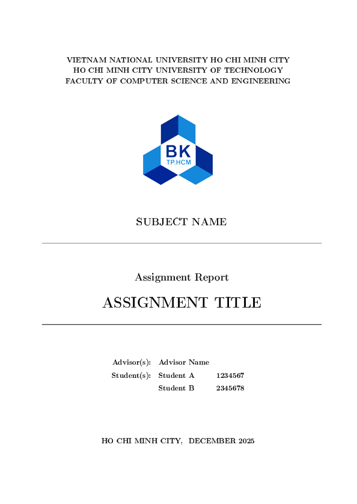

# LaTeX Template

A structured LaTeX template for reports/books with reusable components, consistent styling, and a clear layout. The template separates content, layout, headers, styles, and reusable boxes to keep documents maintainable and easy to extend.



## Quick Start
- Prerequisites: Install TeX Live or MiKTeX. For auto-builds, install `latexmk`.
- Build: From the workspace root, run:

```powershell
latexmk -pdf main.tex
```

- Clean (optional):

```powershell
latexmk -c
```

The main entry point is `main.tex`. Generated PDFs and auxiliary files will be created alongside it.

## Project Structure
- `main.tex`: Top-level document that assembles layout and sections.
- `Layout/`: Page layout, cover, table of contents, references, and the custom class.
	- `main-layout.cls`: Main class that defines page geometry, fonts, headers/footers.
	- `cover.tex`: Cover page content.
	- `table-of-content.tex`: Table of contents configuration.
	- `reference.tex`: References or bibliography section.
	- `contribution.tex`: Author contributions or acknowledgements.
- `Headers/`: Shared header macros and package setup.
	- `lib.tex`: Common packages, commands, and input paths.
- `Sections/`: Your document content, split into logical parts.
	- `main.tex`: Assembles `section1.tex`, `Section2.tex`, etc.
	- `section1.tex`, `Section2.tex`: Example section files.
- `Styles/`: Global styles and custom commands.
	- `global.sty`: Styling for headings, colors, environments.
- `Templates/`: Reusable component templates.
	- `question-box.tex`: A ready-to-use box environment for Q&A or exercises.
- `Graphics/`: Images and figures.

## How It All Connects
`main.tex` loads shared libraries and layout, then includes section files. Typical top-level flow:

```latex
% main.tex (excerpt)
\documentclass{Layout/main-layout}
\input{Headers/lib}
\begin{document}
	\input{Layout/cover}
	\input{Layout/table-of-content}
	\input{Sections/main}
	\input{Layout/reference}
	\input{Layout/contribution}
\end{document}
```

Adjust paths as needed to match your current file names.

## Writing Content
- Put most content in `Sections/sectionX.tex` files.
- Keep reusable macros in `Styles/global.sty` or `Headers/lib.tex`.
- Include images from `Graphics/` using `\includegraphics{Graphics/your-image}`.

### Include Sections in Order
In `Sections/main.tex`, list your sections in the desired order:

```latex
% Sections/main.tex
\input{Sections/section1}
\input{Sections/Section2}
```

## Reusable Components (Copy & Paste)
The template includes pre-written components you can drop into any section.

### Question Box
Add a question/exercise box with a title and body. First, ensure the template is loaded (typically via `Headers/lib.tex` or `Styles/global.sty`). Then use:

```latex
% In your section file
\input{Templates/question-box}

% Example usage
\begin{questionbox}{Sample Question}
State and prove the main theorem for this section.
\end{questionbox}
```

If the environment is provided via `global.sty`, the `\input{Templates/question-box}` line may already be included at the top-level. Duplicate inputs are safe but unnecessary.

### Highlighted Example/Note
Define a simple highlighted block using a custom environment (often in `global.sty`). If already defined, use directly:

```latex
\begin{exampleblock}
This is a highlighted example to draw attention.
\end{exampleblock}
```

If you don’t have `exampleblock` yet, add it in `Styles/global.sty` (or copy from your pre-defined components) like:

```latex
% Styles/global.sty (snippet)
\newenvironment{exampleblock}{\par\noindent\begingroup\bfseries}{\par\endgroup}
```

### Figure Template
Standard figure with caption and label:

```latex
\begin{figure}[ht]
	\centering
	\includegraphics[width=0.8\linewidth]{Graphics/sample}
	\caption{An illustrative figure.}
	\label{fig:sample}
\end{figure}
```

### Table Template

```latex
\begin{table}[ht]
	\centering
	\begin{tabular}{lcr}
		\hline
		Left & Center & Right \\
		\hline
		A & B & C \\
		\hline
	\end{tabular}
	\caption{A simple table.}
	\label{tab:simple}
\end{table}
```

## Tips
- Use `latexmk -pdf` for incremental builds while editing.
- Keep environments/macros centralized in `global.sty` to avoid duplication.
- Prefer `\input{...}` over `\include{...}` for fine-grained control unless large chapters.
- Store all images in `Graphics/` for clean relative paths.

## Troubleshooting
- Missing packages: Ensure `Headers/lib.tex` includes required packages (e.g., `graphicx`, `xcolor`, `hyperref`).
- Path issues: Confirm relative paths match your OS (Windows uses `\\`). LaTeX paths use forward slashes in commands and are OS-agnostic.
- Build errors: Run `latexmk -pdf -interaction=nonstopmode main.tex` to see full logs.